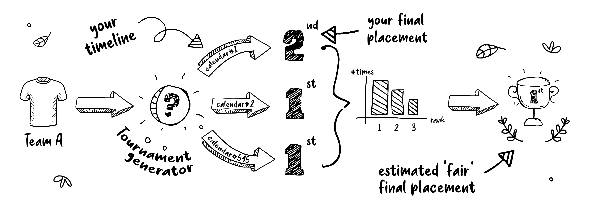
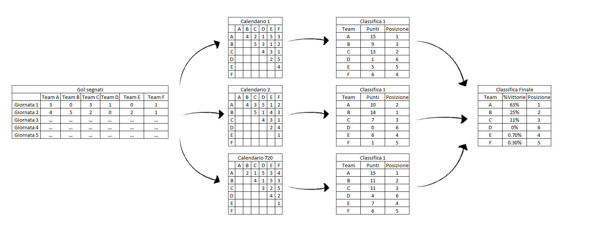

# FantaSimulatore

## Che cos'è FantaSimulatore?

Per vincere il fantacalcio serve un mix di bravura, pianificazione, talent scouting e...fortuna. Tanta fortuna. 

Costruire la rosa più forte possibile talvolta può non essere sufficiente di fronte ad un calendario poco favorevole, dove roboanti pareggi 4-4 si affiancano a risicate vittorie per 1-0.

Lo scopo di **FantaSimulatore** è quello di rimuovere il *Fattore C* - dove *C* non sta per *Calendario* - dal fantacalcio andando a calcolare tutti i possibili sorteggi di calendario e simulando l'esito del campionato per ciascuno di essi.

  

## Come funziona?

FantaSimulatore mantiene il punteggio reale che ogni squadra ha totalizzato per ogni giornata giocata, ma simula tutti i possibili assortimenti alternativi che sarebbero potuti accadere con calendari diversi, determinando gli esiti in termini non assoluti ma di probabilità.

  

A differenza della classifica per punteggio totale, simulare tutti i possibili assortimenti permette di tenere in considerazione non solo il numero di punti fatti ma anche la loro distribuzione: vincere una giornata con cinque gol di scarto e pareggiare la successiva da' meno garanzie rispetto al vincerle entrambe con un gol di scarto.

## Limitazioni

 - Eventuali bonus legati al giocare in casa o in trasferta non vengono ricalcolati e potrebbero alterare il risultato finale.
 - Lo schieramento della propria formazione è considerato indipendente dalla formazione avversaria.
 - Compatibile solo con le leghe gestite tramite [Leghe Fantacalcio](https://leghe.fantacalcio.it/)
 
 ## Creatori

* **Tommaso Buonocore** - *Creatore e Repository Maintainer* - [GitHub](https://github.com/detsutut), [LinkedIn](https://www.linkedin.com/in/tbuonocore/)

## Licenza di Utilizzo

This project is licensed under the GNU GPLv3 License - see the [LICENSE.md](LICENSE.md) file for details
