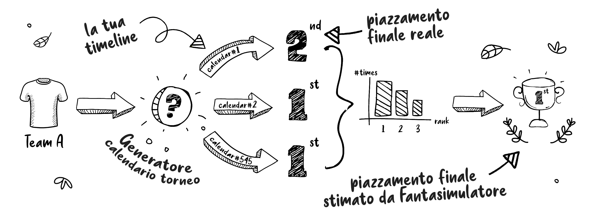

# [FantaSimulatore](https://detsutut.shinyapps.io/fantaSimulatore/)

## Che cos'è FantaSimulatore?

Per vincere il fantacalcio serve un mix di bravura, pianificazione, talent scouting e...fortuna. Tanta fortuna. 

Costruire la rosa più forte possibile talvolta può non essere sufficiente di fronte ad un calendario poco favorevole, dove roboanti pareggi 4-4 si affiancano a risicate vittorie per 1-0.

Lo scopo di **FantaSimulatore** è quello di rimuovere il *Fattore C* - dove *C* non sta per *Calendario* - dal fantacalcio andando a calcolare tutti i possibili sorteggi di calendario e simulando l'esito del campionato per ciascuno di essi.

  

## Come funziona?

FantaSimulatore mantiene il punteggio reale che ogni squadra ha totalizzato per ogni giornata giocata, ma simula tutti i possibili assortimenti alternativi che sarebbero potuti accadere con calendari diversi, determinando gli esiti in termini non assoluti ma di probabilità.

  

A differenza della classifica per punteggio totale, simulare tutti i possibili assortimenti permette di tenere in considerazione non solo il numero di punti fatti ma anche la loro distribuzione: vincere una giornata con cinque gol di scarto e pareggiare la successiva da' meno garanzie rispetto al vincerle entrambe con un gol di scarto.

  

## Come utilizzare FantaSimulatore

Utilizzare **FantaSimulatore** è semplice:

1) accedi alla web app [qui](https://detsutut.shinyapps.io/fantaSimulatore/)
2) se non lo hai già, recupera il calendario della tua lega su [Leghe Fantacalcio](https://leghe.fantacalcio.it/) seguendo le istruzioni fornite dall'applicazione
    - questo passaggio richiede di effettuare il login nella propria lega
3) carica su FantaSimulatore il file appena ottenuto
4) imposta il numero di simulazioni
    - impostando un numero elevato (>10000) di simulazioni, i tempi di simulazione potrebbero essere molto lunghi (10 minuti circa)
    - 500/1000 simulazioni sono sufficienti ad ottenere risultati affidabili (i calendari della competizione da simulare sono campionati casualmente fra tutti i calendari possibili)
5) premi *simula* e attendi che la simulazione sia completata!

## Come interpretare i risultati delle simulazioni

FantaSimulatore fornisce tre parametri di valutazione:

1) **Vittorie Campionato**. Grafico a torta che riporta il numero di campionati simulati vinti da ciascuna squadra. Da una squadra prima in classifica per merito ovviamente ci si aspetta la fetta più grande della torta, e **tanto più ampia è la fetta tanto più robusto alle variazioni di calendario (e quindi legittimo) è il primato**.

2) **Piazzamenti Sul Podio**. Il fantacalcio non è solo primo posto, e una squadra con scarse probabilità di vincere il campionato potrebbe comunque essere la candidata legittima per il secondo gradino del podio ed essere premiata. Questo grafico a barre mostra per ogni squadra il numero di piazzamenti sul podio e la loro ripartizione fra primo, secondo e terzo posto.

3) **Posizionamento Medio**. Infine, la più classica delle valutazioni: il posizionamento medio di ciascuna squadra, ovvero il più giusto criterio secondo cui stilare la classifica finale di arrivo.

## Limitazioni

 - Eventuali bonus legati al giocare in casa o in trasferta non vengono ricalcolati e potrebbero alterare il risultato finale.
 - Lo schieramento della propria formazione è considerato indipendente dalla formazione avversaria.
 - Compatibile solo con le leghe gestite tramite [Leghe Fantacalcio](https://leghe.fantacalcio.it/)
 
 ## Creatori

* **Tommaso Buonocore** - *Creatore e Repository Maintainer* - [GitHub](https://github.com/detsutut), [LinkedIn](https://www.linkedin.com/in/tbuonocore/)

## Licenza di Utilizzo

This project is licensed under the GNU GPLv3 License - see the [LICENSE.md](LICENSE.md) file for details
